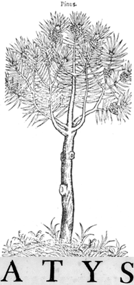

<p align="center">
  <br>
  <em>Atys is preferred all as pine!</em>
</p>   

ATYS - PHP tools for Qobuz library
===========================
_We all prefer him as a pine_

```php
use AtysQobuz\Atys ;

Atys::$AppID = '100000000'; // Optional
Atys::setAPPSecret('XXX'); // If you have one.

Atys::$CacheDirectory = '/home/julien/QobuzCache'; // Active cache functionality
Atys::setCacheLength(7200); // Two Hours

var_dump(Atys::request('album/get', ['album_id' => '3760156050089'])); // Album representation is under AtysQobuz\Entity\Album Class. Other method can return a PHP array translation from Json.
```